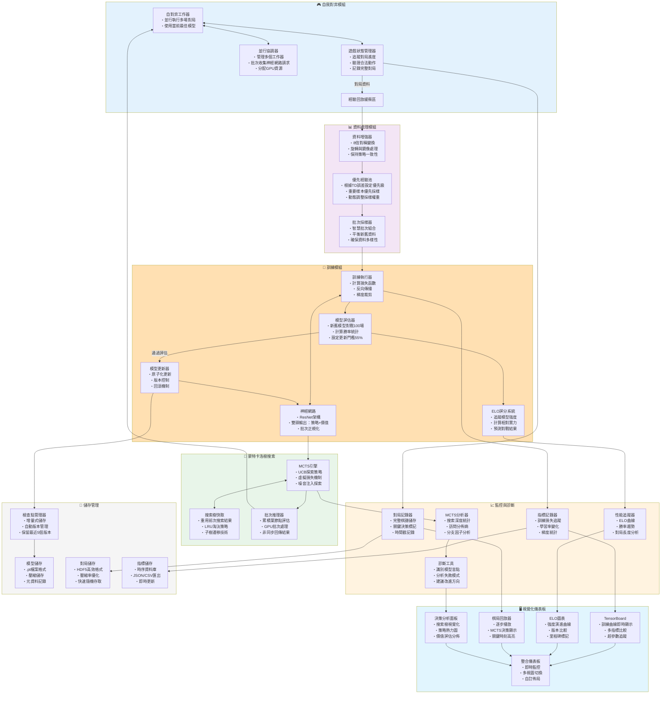

# AlphaZero 棋類 AI 架構圖（PyTorch + 本地可視化）- 改進版

> 本文件提供改進版的 AlphaZero 架構圖與訓練流程，加入關鍵優化組件，專注於 PyTorch 訓練與本地端可視化。

---

## 架構總覽（改進版流程圖）



---

## 核心改進要點

### 1. **並行化與效能優化**

- **批次神經網路推理**：將多個MCTS葉節點評估請求累積成批次，大幅提升GPU使用效率
- **搜索樹重用**：在連續動作間保留並遷移搜索樹，節省約30-50%的模擬次數
- **並行自對弈**：多個工作器同時進行對局，提升資料生成速度

### 2. **訓練穩定性保障**

- **模型評估門檻**：新模型需達到55%勝率才會替換舊模型，防止性能退化
- **資料增強**：利用棋盤8倍對稱性，提升樣本效率並加速收斂
- **優先經驗回放**：重要樣本（高TD誤差）獲得更多訓練機會

### 3. **監控與診斷系統**

- **多維度指標追蹤**
  - 訓練指標：損失曲線、學習率、梯度範數
  - 對弈指標：平均對局長度、先手勝率、平手率
  - MCTS指標：平均搜索深度、訪問分佈熵、有效分支因子
  
- **問題診斷工具**
  - 失敗模式分析：找出重複出現的失敗模式
  - 關鍵決策識別：標記價值評估劇烈變化的時刻
  - 盲點檢測：發現模型系統性錯誤

### 4. **資源管理策略**

- **記憶體優化**
  - 滑動窗口機制：只保留最近50萬個樣本
  - 增量檢查點：只儲存與前版本的差異
  - HDF5壓縮：對局資料壓縮率達70%

- **儲存空間管理**
  - 自動清理：保留最近5個模型版本
  - 分層儲存：熱資料在SSD，冷資料在HDD
  - 快照備份：關鍵里程碑完整備份

### 5. **訓練流程控制**

- **動態超參數調整**
  - MCTS模擬次數：初期400次 → 後期1600次
  - 探索溫度：前30步τ=1.0 → 之後τ→0
  - 學習率排程：Cosine annealing with warm-up

- **自適應訓練策略**
  - 根據ELO進展調整訓練/自對弈比例
  - 困難局面自動增加MCTS模擬次數
  - 收斂後自動降低學習率

---

## 實施優先順序

### 第一階段（核心功能）
1. 實作基礎Self-Play + MCTS + 神經網路
2. 加入資料增強（8倍對稱）
3. 實作檢查點管理與基礎視覺化

### 第二階段（效能優化）
1. 批次神經網路推理
2. 搜索樹快取與重用
3. 並行自對弈系統

### 第三階段（穩定性提升）
1. 模型評估器與更新門檻
2. 優先經驗回放
3. ELO評分系統

### 第四階段（進階功能）
1. 完整診斷工具
2. 進階視覺化儀表板
3. 自適應訓練策略

---

## 硬體資源建議

### 最低配置
- GPU: RTX 3070 (8GB VRAM)
- CPU: 8核心處理器
- RAM: 32GB
- 儲存: 500GB SSD

### 建議配置
- GPU: RTX 4090 (24GB VRAM)
- CPU: 16核心處理器
- RAM: 64GB
- 儲存: 1TB NVMe SSD + 4TB HDD

### 效能預估
- 自對弈速度：~100場/小時（建議配置）
- 訓練批次：256（建議配置）
- 收斂時間：圍棋約7天，西洋棋約3天

---

## 關鍵設計決策說明

### 為什麼需要模型評估器？
防止訓練過程中因為過擬合或訓練不穩定導致模型性能下降。只有新模型確實比舊模型強才會更新。

### 為什麼要用優先經驗回放？
某些關鍵局面（如殘局）的樣本較少但很重要，優先回放確保這些樣本得到充分訓練。

### 為什麼要快取搜索樹？
MCTS搜索成本高，重用前一步的搜索結果可節省大量計算資源，特別是在深度搜索時。

### 為什麼需要ELO系統？
單純的勝率無法反映模型的絕對強度進步，ELO分數提供了更客觀的強度評估標準。


########################################################################################

# AlphaZero Chess AI

基於 PyTorch 的西洋棋 AI 訓練框架，實現了 AlphaZero 演算法。

## 專案結構

```
alphazero_chess/
├── __init__.py              # 包初始化
├── config.py               # 配置模組
├── chess_encoder.py        # 棋盤編碼器
├── model.py               # 神經網路模型
├── mcts.py                # 蒙特卡洛樹搜索
├── data_utils.py          # 資料處理工具
├── self_play.py           # 自對弈模組
├── trainer.py             # 訓練器
├── visualization.py       # 視覺化工具
├── main.py               # 主程序
├── requirements.txt      # 依賴套件
└── README.md            # 專案說明
```

## 功能特色

- **完整的 AlphaZero 實現**：包含自對弈、神經網路訓練和模型評估
- **高效的 MCTS**：支援並行搜索和樹快取
- **模組化設計**：各組件獨立，易於維護和擴展
- **資料增強**：利用棋盤對稱性增加訓練資料
- **優先經驗回放**：提高訓練效率
- **詳細日誌**：完整的訓練過程記錄
- **視覺化工具**：訓練曲線和搜索樹可視化

## 安裝

1. 克隆專案：
```bash
git clone <repository-url>
cd alphazero_chess
```

2. 安裝依賴：
```bash
pip install -r requirements.txt
```

## 使用方法

### 基本訓練

```python
from config import AlphaZeroConfig
from trainer import AlphaZeroTrainer

# 創建配置
config = AlphaZeroConfig()

# 創建訓練器
trainer = AlphaZeroTrainer(config)

# 執行訓練
for i in range(1000):
    trainer.train_iteration()
```

### 自定義配置

```python
config = AlphaZeroConfig(
    num_res_blocks=19,        # 殘差塊數量
    num_filters=256,          # 濾波器數量
    num_simulations=800,      # MCTS 模擬次數
    batch_size=256,           # 批次大小
    learning_rate=0.01,       # 學習率
    num_games_per_iteration=1000  # 每次迭代的對弈數
)
```

### 載入檢查點

```python
# 從檢查點繼續訓練
trainer.load_checkpoint('checkpoints/checkpoint_iter_100.pt')
```

### 視覺化

```python
from visualization import AlphaZeroVisualizer

visualizer = AlphaZeroVisualizer(trainer)
visualizer.plot_training_curves()
```

## 配置參數

### 神經網路參數
- `num_res_blocks`: 殘差塊數量 (預設: 19)
- `num_filters`: 卷積濾波器數量 (預設: 256)

### MCTS 參數
- `num_simulations`: 每次搜索的模擬次數 (預設: 800)
- `c_puct`: UCB 探索常數 (預設: 1.0)
- `dirichlet_alpha`: Dirichlet 噪音參數 (預設: 0.3)

### 訓練參數
- `batch_size`: 批次大小 (預設: 256)
- `learning_rate`: 學習率 (預設: 0.01)
- `num_games_per_iteration`: 每次迭代的對弈數 (預設: 5000)

### 評估參數
- `evaluation_games`: 模型評估對弈數 (預設: 100)
- `evaluation_win_rate_threshold`: 更新模型的勝率閾值 (預設: 0.55)

## 檔案說明

### 核心模組

- **config.py**: 定義所有超參數和配置選項
- **chess_encoder.py**: 將棋盤狀態和走法編碼為神經網路輸入/輸出
- **model.py**: 實現 AlphaZero 的殘差神經網路架構
- **mcts.py**: 蒙特卡洛樹搜索演算法實現

### 訓練相關

- **self_play.py**: 自對弈模組，支援並行對弈
- **trainer.py**: 主要訓練循環，整合所有組件
- **data_utils.py**: 資料處理工具，包含經驗回放和資料增強

### 輔助工具

- **visualization.py**: 視覺化工具，用於監控訓練進度
- **main.py**: 主程序入口點

## 效能優化

- 使用 GPU 加速訓練
- 並行自對弈生成資料
- 優先經驗回放提高樣本效率
- 樹快取減少重複計算
- 梯度裁剪防止梯度爆炸

## 系統需求

- Python 3.8+
- PyTorch 1.12+
- CUDA (可選，用於 GPU 加速)
- 16GB+ RAM (推薦)
- 100GB+ 存儲空間 (用於檢查點和日誌)

## 注意事項

1. 訓練需要大量計算資源，建議使用 GPU
2. 完整訓練可能需要數天到數週時間
3. 定期保存檢查點以防止意外中斷
4. 監控記憶體使用量，避免 OOM 錯誤

## 貢獻

歡迎提交 Issue 和 Pull Request 來改進這個專案。

## 授權

此專案採用 MIT 授權條款。