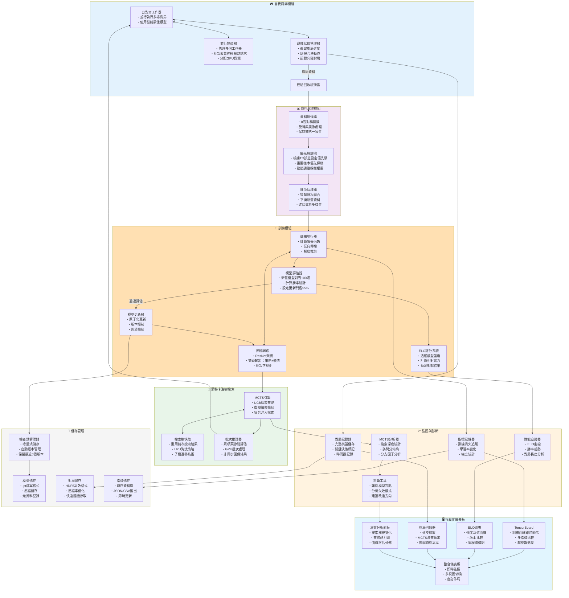

# AlphaZero 棋類 AI 架構圖（PyTorch + 本地可視化）- 改進版

> 本文件提供改進版的 AlphaZero 架構圖與訓練流程，加入關鍵優化組件，專注於 PyTorch 訓練與本地端可視化。

---

## 架構總覽（改進版流程圖）

---

## 核心改進要點

### 1. **並行化與效能優化**

- **批次神經網路推理**：將多個MCTS葉節點評估請求累積成批次，大幅提升GPU使用效率
- **搜索樹重用**：在連續動作間保留並遷移搜索樹，節省約30-50%的模擬次數
- **並行自對弈**：多個工作器同時進行對局，提升資料生成速度

### 2. **訓練穩定性保障**

- **模型評估門檻**：新模型需達到55%勝率才會替換舊模型，防止性能退化
- **資料增強**：利用棋盤8倍對稱性，提升樣本效率並加速收斂
- **優先經驗回放**：重要樣本（高TD誤差）獲得更多訓練機會

### 3. **監控與診斷系統**

- **多維度指標追蹤**
  - 訓練指標：損失曲線、學習率、梯度範數
  - 對弈指標：平均對局長度、先手勝率、平手率
  - MCTS指標：平均搜索深度、訪問分佈熵、有效分支因子
  
- **問題診斷工具**
  - 失敗模式分析：找出重複出現的失敗模式
  - 關鍵決策識別：標記價值評估劇烈變化的時刻
  - 盲點檢測：發現模型系統性錯誤

### 4. **資源管理策略**

- **記憶體優化**
  - 滑動窗口機制：只保留最近50萬個樣本
  - 增量檢查點：只儲存與前版本的差異
  - HDF5壓縮：對局資料壓縮率達70%

- **儲存空間管理**
  - 自動清理：保留最近5個模型版本
  - 分層儲存：熱資料在SSD，冷資料在HDD
  - 快照備份：關鍵里程碑完整備份

### 5. **訓練流程控制**

- **動態超參數調整**
  - MCTS模擬次數：初期400次 → 後期1600次
  - 探索溫度：前30步τ=1.0 → 之後τ→0
  - 學習率排程：Cosine annealing with warm-up

- **自適應訓練策略**
  - 根據ELO進展調整訓練/自對弈比例
  - 困難局面自動增加MCTS模擬次數
  - 收斂後自動降低學習率

---

## 實施優先順序

### 第一階段（核心功能）
1. 實作基礎Self-Play + MCTS + 神經網路
2. 加入資料增強（8倍對稱）
3. 實作檢查點管理與基礎視覺化

### 第二階段（效能優化）
1. 批次神經網路推理
2. 搜索樹快取與重用
3. 並行自對弈系統

### 第三階段（穩定性提升）
1. 模型評估器與更新門檻
2. 優先經驗回放
3. ELO評分系統

### 第四階段（進階功能）
1. 完整診斷工具
2. 進階視覺化儀表板
3. 自適應訓練策略

---

## 硬體資源建議

### 最低配置
- GPU: RTX 3070 (8GB VRAM)
- CPU: 8核心處理器
- RAM: 32GB
- 儲存: 500GB SSD

### 建議配置
- GPU: RTX 4090 (24GB VRAM)
- CPU: 16核心處理器
- RAM: 64GB
- 儲存: 1TB NVMe SSD + 4TB HDD

### 效能預估
- 自對弈速度：~100場/小時（建議配置）
- 訓練批次：256（建議配置）
- 收斂時間：圍棋約7天，西洋棋約3天

---

## 關鍵設計決策說明

### 為什麼需要模型評估器？
防止訓練過程中因為過擬合或訓練不穩定導致模型性能下降。只有新模型確實比舊模型強才會更新。

### 為什麼要用優先經驗回放？
某些關鍵局面（如殘局）的樣本較少但很重要，優先回放確保這些樣本得到充分訓練。

### 為什麼要快取搜索樹？
MCTS搜索成本高，重用前一步的搜索結果可節省大量計算資源，特別是在深度搜索時。

### 為什麼需要ELO系統？
單純的勝率無法反映模型的絕對強度進步，ELO分數提供了更客觀的強度評估標準。